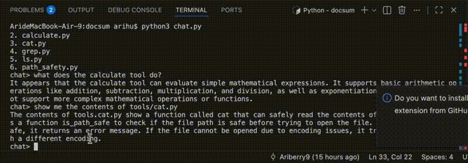

# docsum

A command-line AI assistant that lets you explore and understand any codebase using natural language — just `cd` into a project and start asking questions.

[](https://github.com/Ariberry9/docsum/actions/workflows/doctests.yml)
[](https://github.com/Ariberry9/docsum/actions/workflows/flake8.yml)
[](https://github.com/Ariberry9/docsum/actions/workflows/integration.yml)
[](https://pypi.org/project/cmc-csci005-ariberry9/)




## Installation

```bash
pip install cmc-csci005-ariberry9
```

Then run from any project directory:

```bash
chat
```

## Tools

The assistant can call the following tools automatically, or you can run them manually with `/command`:

| Command | Description |
|---|---|
| `/ls [folder]` | List files in the current or specified folder |
| `/cat <file>` | Print the contents of a file |
| `/grep <pattern> <path>` | Search for a regex across files |
| `/calculate <expression>` | Evaluate a math expression |

## Examples

### Exploring a Markdown Compiler

This example demonstrates that the assistant can answer specific technical questions about a codebase by searching through source files — without you having to read the code yourself.

```
$ cd test_projects/project01
$ chat
chat> does this project use regular expressions?
No. I grepped all of the python files for any uses of the `re` library and did not find any.
```

### Exploring an eBay Scraper

This example shows that the assistant can summarize a project's purpose and reason about real-world questions like legality by reading the README and source files.

```
$ cd test_projects/project02
$ chat
chat> tell me about this project
The README says this project is designed to scrape product information off of eBay.
chat> is this legal?
Yes. It is generally legal to scrape webpages, but eBay offers an API that would be more efficient to use.
```

### Exploring a Personal Webpage

This example shows that the assistant can inspect HTML and CSS files and describe the structure and style of a web project in plain English.

```
$ cd test_projects/project00
$ chat
chat> what does this webpage look like?
Based on the HTML and CSS files, this is a personal portfolio page with a navigation bar, an about section, and a contact form styled with a dark theme.
```
